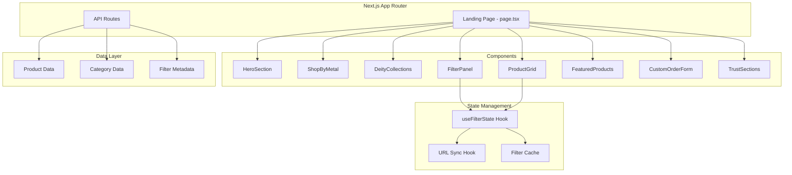

# Design Document: Handicraft Landing Page

## Overview

This design document outlines the architecture and implementation approach for a Brass & Copper Handicraft Store landing page built with Next.js 16, React 19, and Tailwind CSS 4. The landing page serves as the primary customer entry point, featuring a hero section, metal-based product browsing, deity collections, a sophisticated client-side filtering system, featured products, custom order forms, and trust-building content sections.

The filter system implements a hierarchical filtering approach: Metal → Category → Filters → Product Grid, with real-time updates, URL state synchronization, and performance optimizations including debouncing and caching.

## Architecture



## Components and Interfaces

### Component Hierarchy

```
src/
├── app/
│   ├── page.tsx                    # Landing page
│   ├── layout.tsx                  # Root layout
│   └── api/
│       └── products/
│           └── route.ts            # Products API endpoint
├── components/
│   ├── landing/
│   │   ├── HeroSection.tsx         # Hero with title, badges, CTAs
│   │   ├── ShopByMetal.tsx         # Metal category cards
│   │   ├── DeityCollections.tsx    # Deity category grid
│   │   ├── FeaturedProducts.tsx    # Featured product showcase
│   │   ├── CustomOrderForm.tsx     # Custom order request form
│   │   ├── WhyChooseUs.tsx         # Trust points section
│   │   ├── AboutUsSection.tsx      # Brief brand story
│   │   └── FinalCTA.tsx            # Final conversion section
│   ├── filters/
│   │   ├── FilterPanel.tsx         # Main filter container
│   │   ├── MetalSelect.tsx         # Metal type dropdown
│   │   ├── CategorySelect.tsx      # Category dropdown
│   │   ├── RangeFilter.tsx         # Reusable range slider/input
│   │   ├── MultiSelectFilter.tsx   # Multi-select checkbox filter
│   │   └── ResetButton.tsx         # Reset filters button
│   ├── products/
│   │   ├── ProductGrid.tsx         # Responsive product grid
│   │   ├── ProductCard.tsx         # Individual product card
│   │   └── LoadingGrid.tsx         # Loading skeleton
│   └── ui/
│       ├── Button.tsx              # Reusable button component
│       ├── Badge.tsx               # Trust badge component
│       └── Card.tsx                # Reusable card component
├── hooks/
│   ├── useFilterState.ts           # Filter state management
│   ├── useURLSync.ts               # URL query param sync
│   ├── useDebounce.ts              # Debounce utility hook
│   └── useFilterCache.ts           # Filter result caching
├── types/
│   └── index.ts                    # TypeScript interfaces
├── lib/
│   ├── filterUtils.ts              # Filter logic utilities
│   └── api.ts                      # API client functions
└── data/
    ├── products.ts                 # Mock product data
    ├── categories.ts               # Category definitions
    └── metals.ts                   # Metal type definitions
```

### Core Interfaces

```typescript
// types/index.ts

export type MetalType = 'Brass' | 'Copper' | 'Panchdhatu' | 'Custom';

export type FinishType = 'Antique' | 'Glossy' | 'Matte' | 'Gold-plated';

export type CategoryType = 
  | 'Ganesh' | 'Laxmi' | 'Hanuman' | 'Buddha' 
  | 'Yantra' | 'Diyas' | 'Brackets' | 'Temple Items';

export interface Product {
  id: string;
  name: string;
  metal: MetalType;
  category: CategoryType;
  price: number;
  weightKg: number;
  heightInch: number;
  finishType: FinishType;
  stock: number;
  images: string[];
  description: string;
  createdAt: Date;
}

export interface FilterState {
  metal: MetalType | null;
  category: CategoryType | null;
  priceMin: number | null;
  priceMax: number | null;
  weightMin: number | null;
  weightMax: number | null;
  heightMin: number | null;
  heightMax: number | null;
  finishTypes: FinishType[];
}

export interface FilterMetadata {
  availableCategories: CategoryType[];
  priceRange: { min: number; max: number };
  weightRange: { min: number; max: number };
  heightRange: { min: number; max: number };
}

export interface CustomOrderRequest {
  designFile: File | null;
  size: string;
  material: MetalType;
  contactName: string;
  contactEmail: string;
  contactPhone: string;
  notes: string;
}

export interface MetalCategory {
  type: MetalType;
  title: string;
  description: string;
  itemTypes: string[];
  image: string;
}

export interface DeityCategory {
  id: string;
  name: string;
  slug: string;
  image: string;
}
```

### Hook Interfaces

```typescript
// hooks/useFilterState.ts
export interface UseFilterStateReturn {
  filters: FilterState;
  setMetal: (metal: MetalType | null) => void;
  setCategory: (category: CategoryType | null) => void;
  setPriceRange: (min: number | null, max: number | null) => void;
  setWeightRange: (min: number | null, max: number | null) => void;
  setHeightRange: (min: number | null, max: number | null) => void;
  setFinishTypes: (types: FinishType[]) => void;
  resetFilters: () => void;
  metadata: FilterMetadata | null;
  isLoading: boolean;
}

// hooks/useURLSync.ts
export interface UseURLSyncReturn {
  syncToURL: (filters: FilterState) => void;
  getFiltersFromURL: () => Partial<FilterState>;
}
```

## Data Models

### Product Schema

```typescript
// Represents a product in the store
interface ProductSchema {
  id: string;              // Unique identifier
  name: string;            // Product display name
  metal: MetalType;        // Base material type
  category: CategoryType;  // Deity/item category
  price: number;           // Price in INR
  weightKg: number;        // Weight in kilograms
  heightInch: number;      // Height in inches
  finishType: FinishType;  // Surface finish type
  stock: number;           // Available quantity
  images: string[];        // Array of image URLs
  description: string;     // Product description
  createdAt: Date;         // Creation timestamp
}
```

### Filter Query Parameters

```typescript
// URL query parameter mapping
interface FilterQueryParams {
  metal?: string;          // ?metal=Brass
  category?: string;       // &category=Ganesh
  price_min?: string;      // &price_min=200
  price_max?: string;      // &price_max=5000
  weight_min?: string;     // &weight_min=1
  weight_max?: string;     // &weight_max=10
  height_min?: string;     // &height_min=5
  height_max?: string;     // &height_max=24
  finish?: string;         // &finish=Antique,Glossy (comma-separated)
}
```

### Metal-Category Mapping

```typescript
// Defines which categories are available for each metal type
const metalCategoryMap: Record<MetalType, CategoryType[]> = {
  'Brass': ['Ganesh', 'Laxmi', 'Buddha', 'Diyas', 'Brackets', 'Hanuman'],
  'Copper': ['Yantra', 'Temple Items'],
  'Panchdhatu': ['Ganesh', 'Laxmi', 'Hanuman', 'Buddha'],
  'Custom': ['Ganesh', 'Laxmi', 'Hanuman', 'Buddha', 'Yantra', 'Diyas', 'Brackets', 'Temple Items']
};
```


## Correctness Properties

*A property is a characteristic or behavior that should hold true across all valid executions of a system-essentially, a formal statement about what the system should do. Properties serve as the bridge between human-readable specifications and machine-verifiable correctness guarantees.*

Based on the acceptance criteria analysis, the following correctness properties must be verified through property-based testing:

### Property 1: Filter AND Logic

*For any* combination of filter values (metal, category, price range, weight range, height range, finish types), all products returned by the filter function SHALL satisfy ALL specified filter conditions simultaneously.

**Validates: Requirements 4.9**

### Property 2: Filter Reset Preserves Metal

*For any* filter state with a selected metal type and any combination of other filters applied, invoking the reset function SHALL clear all filters (category, price, weight, height, finish) while preserving the selected metal type.

**Validates: Requirements 4.10**

### Property 3: Metal Selection Updates Categories

*For any* metal type selection, the filter system SHALL load only the categories defined in the metal-category mapping for that metal type, and SHALL reset all other filter values to their default state.

**Validates: Requirements 4.2, 4.3**

### Property 4: Product Card Rendering Completeness

*For any* valid product object, the rendered product card SHALL contain the product name, at least one image, price in INR, weight in kg, height in inches, and finish type.

**Validates: Requirements 5.1, 5.2**

### Property 5: Valid Form Submission Success

*For any* custom order form submission where all required fields (design file or size, material, contact name, contact email, contact phone) contain valid non-empty values, the form submission SHALL succeed and return a confirmation.

**Validates: Requirements 6.2**

### Property 6: Invalid Form Submission Shows Errors

*For any* custom order form submission where one or more required fields are empty or invalid, the form validation SHALL return error messages identifying each invalid field.

**Validates: Requirements 6.3**

### Property 7: URL Filter State Round-Trip

*For any* valid filter state, serializing the state to URL query parameters and then parsing those parameters back SHALL produce an equivalent filter state.

**Validates: Requirements 8.1, 8.2**

### Property 8: Filter Result Caching

*For any* filter combination that has been previously queried, subsequent identical queries SHALL return cached results without making additional API calls.

**Validates: Requirements 9.3**

### Property 9: Metal Card Navigation

*For any* metal category card click, the navigation SHALL route to a URL containing the correct metal type as a query parameter.

**Validates: Requirements 2.6**

### Property 10: Deity Card Navigation

*For any* deity category card click, the navigation SHALL route to the correct deity-specific URL path.

**Validates: Requirements 3.2**

## Error Handling

### Filter Errors

| Error Scenario | Handling Strategy |
|----------------|-------------------|
| Invalid price range (min > max) | Swap values automatically, display corrected range |
| Invalid weight/height range | Swap values automatically, display corrected range |
| API fetch failure | Display error message, retain previous results, offer retry |
| Invalid URL parameters | Ignore invalid params, apply valid ones, log warning |
| Empty filter results | Display "No products found" message with suggestions |

### Form Validation Errors

| Field | Validation Rule | Error Message |
|-------|-----------------|---------------|
| Contact Name | Required, min 2 chars | "Please enter your name" |
| Contact Email | Required, valid email format | "Please enter a valid email address" |
| Contact Phone | Required, valid phone format | "Please enter a valid phone number" |
| Material | Required selection | "Please select a material type" |
| Size | Required if no design file | "Please specify the required size" |

### Network Errors

- Implement retry logic with exponential backoff (max 3 retries)
- Show loading skeleton during retries
- Display user-friendly error message after all retries fail
- Cache successful responses to reduce network dependency

## Testing Strategy

### Property-Based Testing Framework

The project will use **fast-check** as the property-based testing library for TypeScript/JavaScript. Each property-based test will run a minimum of 100 iterations.

### Test File Structure

```
src/
├── __tests__/
│   ├── filters/
│   │   ├── filterLogic.test.ts      # Filter AND logic tests
│   │   ├── filterReset.test.ts      # Reset behavior tests
│   │   ├── metalCategories.test.ts  # Metal-category mapping tests
│   │   └── urlSync.test.ts          # URL serialization tests
│   ├── components/
│   │   ├── ProductCard.test.tsx     # Product card rendering tests
│   │   └── CustomOrderForm.test.tsx # Form validation tests
│   └── hooks/
│       └── useFilterCache.test.ts   # Caching behavior tests
```

### Unit Testing Approach

Unit tests will cover:
- Specific edge cases (empty inputs, boundary values)
- Component rendering with specific props
- Integration between filter components
- Navigation behavior verification

### Property-Based Testing Approach

Property tests will verify:
- Filter logic correctness across all input combinations
- URL serialization/deserialization round-trip
- Form validation for all field combinations
- Cache behavior consistency

Each property-based test MUST be tagged with a comment referencing the correctness property:
```typescript
// **Feature: handicraft-landing-page, Property 1: Filter AND Logic**
```

### Test Configuration

```typescript
// fast-check configuration
fc.configureGlobal({
  numRuns: 100,
  verbose: true
});
```

### Generators

Custom generators will be created for:
- `ProductArbitrary`: Generates valid Product objects
- `FilterStateArbitrary`: Generates valid FilterState objects
- `CustomOrderArbitrary`: Generates valid/invalid CustomOrderRequest objects
- `MetalTypeArbitrary`: Generates valid MetalType values
- `URLParamsArbitrary`: Generates valid URL query parameter combinations
